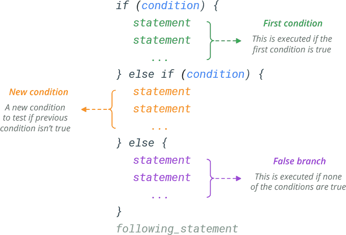

# Instructiunea *else*
Instructiunea else este o instructiune decizionala care vine in completarea instructiunii if. Astfel ca ea determina executia codului din interiorul acoladelor asociate instructiunii else atunci cand expresia din interiorul parantezelor instructiunii if nu este adevarata.


### Exemplu conditie adevarata


```c#
int nota = 5;

if (nota > 4 == true)
{
  Console.WriteLine("Felicitari, ai luat o nota de trecere!");
}
else
{
  Console.WriteLine("Ne pare rau. Nu ai luat nota de trecere.");
  Console.WriteLine("Sa vedem ce vei face la urmatorul examen.");
}

```

In exemplul de mai sus, variabila nota are valoare 5 si deci la executia programului se vor afisa doar mesajul:
```
Felicitari, ai luat o nota de trecere!
```

### Exemplu conditie falsa

```c#
int nota = 3;

if (nota > 4 == true)
{
  Console.WriteLine("Felicitari, ai luat o nota de trecere!");
}
else
{
  Console.WriteLine("Ne pare rau. Nu ai luat nota de trecere.");
  Console.WriteLine("Sa vedem ce vei face la urmatorul examen.");
}
```

In exemplul de mai sus, variabila nota are valoare 3 si cum 3 nu este mai mare decat 4, la executia programului se vo afisa mesajele:
```
Ne pare rau. Nu ai luat nota de trecere.
Sa vedem ce vei face la urmatorul examen.
```


## Acolade optionale
La fel ca la instructiunea if, in cazul in care bucata de cod contionata este doar o singura linie de cod, acoladele sunt optionale. Este de preferat totusi, dar nu obligatorie, mentinerea indentarii liniei de cod conditionata. 
```c#
int nota = 3;

if (nota > 4 == true)
  Console.WriteLine("Felicitari, ai luat o nota de trecere!");
else
  Console.WriteLine("Ne pare rau. Nu ai luat nota de trecere.");
Console.WriteLine("Sa vedem ce vei face la urmatorul examen.");
```
In exemplul de mai sus mesajul, '*Sa vedem ce vei face la urmatorul examen.*', se va afisa indiferent de valoarea notei.

## If else
Instructiunea *if else* poate fi folosita pentru a testa o noua conditie, daca prima prima este falsa.



### Exemplu

```c#
if (x > y)
  Console.WriteLine("x este mai mare");
else if (x < y)
  Console.WriteLine("y este mai mare");
else
  Console.WriteLine("x is y sunt egale");
```

In exemplul de mai sus se verifica urmatoarele:
- prima conditie verifica daca x este mai mare decat y.
- daca prima conditie nu este adevarata, se trece la urmatoare verificare, daca x este mai mic decat y.
- daca nici una dintre conditii este adevarata, se executa direct instructiunea else. in acest caz singura posibilitate ramasa este ca cele doua variabile sa fie egale intre ele.